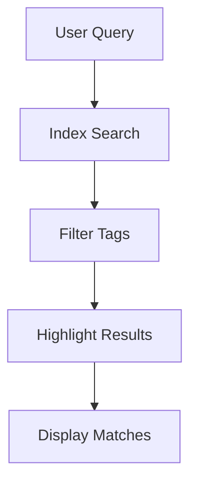

## Overview

Haltman provides powerful features to streamline your documentation workflow. You organize content hierarchically, collaborate in real-time, search efficiently, and track changes with version control. These tools help teams maintain consistent, up-to-date documentation.

<Columns cols={2}>
  <Card title="Organize Easily" icon="folder" href="#document-organization">
    Structure your docs with folders and pages.
  </Card>
  <Card title="Collaborate Seamlessly" icon="users" href="#collaboration">
    Edit together with live previews.
  </Card>
  <Card title="Search Smartly" icon="search" href="#search">
    Find content quickly with advanced filters.
  </Card>
  <Card title="Track Versions" icon="git-branch" href="#version-control">
    Revert changes and maintain history.
  </Card>
</Columns>

## Document Organization and Structuring

Create a clear hierarchy for your documentation using folders, pages, and subpages. You nest content logically to reflect your project's structure.

<Steps>
  <Step title="Create Folders" icon="folder-plus">
    Start by creating top-level folders for major sections like "API Reference" or "User Guides".

    ```
    /docs
    ├── api/
    ├── guides/
    └── changelog/
    ```
  </Step>
  <Step title="Add Pages" icon="file-text">
    Within folders, add MDX pages with frontmatter for metadata.
  </Step>
  <Step title="Link Navigation" icon="link">
    Use sidebar configuration to auto-generate navigation.
  </Step>
</Steps>

<Callout kind="tip">
  Use consistent naming conventions like `{kebab-case}` for page slugs to improve navigation.
</Callout>

## Collaboration and Editing Workflows

Invite team members to edit documents simultaneously. Changes appear live, with conflict resolution built-in.

<Tabs>
  <Tab title="Editor Role" icon="edit-3">
    Make changes and see real-time updates from others.

    <CodeGroup tabs="Markdown,MDX">
    ````markdown
    ## Heading

    Edit this content collaboratively.
    ````

    ````mdx
    ## Heading

    <Callout kind="info">Live collaboration active.</Callout>
    ````
    </CodeGroup>
  </Tab>
  <Tab title="Reviewer Role" icon="eye">
    Preview changes and leave inline comments without editing.
  </Tab>
</Tabs>

## Search and Filtering Capabilities

Haltman's search indexes all content, including code blocks and frontmatter. Filter by tags, dates, or authors.



Use the API for programmatic search:

<CodeGroup tabs="JavaScript,Python">
````javascript
const results = await fetch('https://api.example.com/search?q=authentication&tags=guide');
console.log(results);
````

````python
import requests
response = requests.get('https://api.example.com/search', params={
    'q': 'authentication',
    'tags': 'guide'
})
print(response.json())
````
</CodeGroup>

<ParamField query="q" param-type="string" required="true">
  Search query string.
</ParamField>

<ParamField query="tags" param-type="array" required="false">
  Filter by comma-separated tags.
</ParamField>

## Version Control Basics

Track every change with automatic versioning. Compare diffs and revert to previous versions.

<Expandable title="Advanced Version Workflow" default-open="false">
  Branch documents for experiments:

  ```
  main ── v1.0 ── v1.1
           │
         feature-branch
  ```

  Merge via pull requests with approval workflows.
</Expandable>

<Callout kind="success">
  Enable version control in project settings to start tracking changes immediately.
</Callout>

## Next Steps

Explore these features hands-on:

<Columns cols={3}>
  <Card title="Quickstart" icon="rocket" href="/quickstart">
    Set up your first project.
  </Card>
  <Card title="API Reference" icon="code" href="/authentication">
    Integrate programmatically.
  </Card>
  <Card title="Changelog" icon="git-commit" href="/changelog">
    See recent updates.
  </Card>
</Columns>