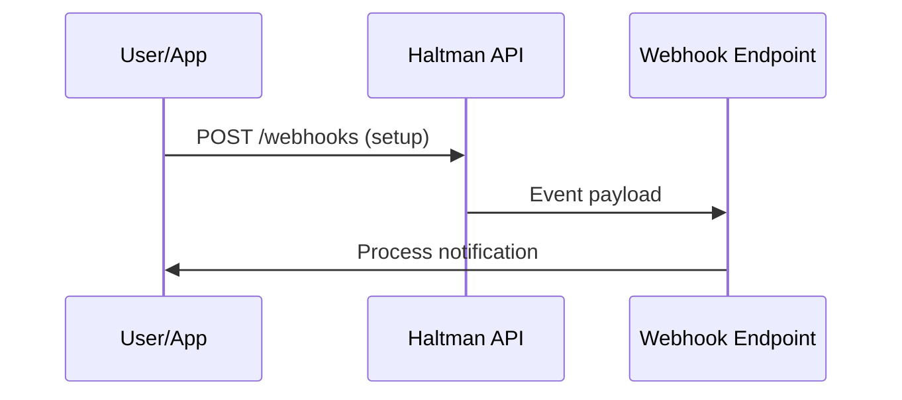

## Overview

Haltman supports seamless integrations with popular third-party services, webhooks for real-time notifications, and a robust API for custom automation. Use these features to sync your documentation with tools like Slack, GitHub, and Zapier, or build tailored workflows.

<Callout kind="tip">
Explore the [API reference](/api-reference) for full endpoint details and authentication requirements.
</Callout>

## Third-Party Integrations

Connect Haltman to external apps for automated updates, version control syncs, and more. Start with these popular integrations:

<Columns cols={3}>
  <Card title="Slack" icon="message-circle" href="https://slack.com/apps" target="_blank">
    Receive notifications for doc updates and share links directly in channels.
  </Card>
  <Card title="GitHub" icon="github" href="https://github.com/apps" target="_blank">
    Sync documentation changes with repositories and automate PR reviews.
  </Card>
  <Card title="Zapier" icon="zap" href="https://zapier.com/apps" target="_blank">
    Create no-code automations with 5000+ apps using Haltman triggers.
  </Card>
</Columns>

| Integration | Use Case | Setup Time |
|-------------|----------|------------|
| Slack       | Notifications | 5 minutes |
| GitHub      | Version sync  | 10 minutes|
| Zapier      | Custom workflows | 15 minutes|

## Webhook Setup

Set up webhooks to receive real-time events from Haltman, such as document updates or user actions.

<Steps>
  <Step title="Create Webhook" icon="plus">
    Navigate to your Haltman dashboard at `https://dashboard.example.com/settings/webhooks`.

    Click "New Webhook" and enter your endpoint URL, like `https://your-webhook-url.com/haltman`.
  </Step>
  <Step title="Configure Events" icon="settings">
    Select events to subscribe to:

````javascript
[
  "doc.updated",
  "doc.published",
  "user.invited"
]
````

  </Step>
  <Step title="Test and Save" icon="check-circle">
    Send a test event and verify receipt. Save the webhook.
  </Step>
</Steps>

<Request tabs="cURL,JavaScript" show-lines="true">
```bash
curl -X POST https://api.example.com/v1/webhooks \
  -H "Authorization: Bearer YOUR_API_KEY" \
  -H "Content-Type: application/json" \
  -d '{
    "url": "https://your-webhook-url.com/haltman",
    "events": ["doc.updated"]
  }'
```

````javascript
const response = await fetch('https://api.example.com/v1/webhooks', {
  method: 'POST',
  headers: {
    'Authorization': 'Bearer YOUR_API_KEY',
    'Content-Type': 'application/json'
  },
  body: JSON.stringify({
    url: 'https://your-webhook-url.com/haltman',
    events: ['doc.updated']
  })
});
````
</Request>

## Custom API Integrations

Build advanced integrations using Haltman's REST API. Authenticate with `YOUR_API_KEY` and interact with endpoints like document management.

<ParamField path="docId" param-type="string" required="true">
  Unique document identifier.
</ParamField>

<ParamField header="Authorization" param-type="string" required="true">
  Bearer token: `Bearer YOUR_API_KEY`.
</ParamField>

<CodeGroup tabs="JavaScript,Python">
```javascript
const response = await fetch('https://api.example.com/v1/docs/{docId}', {
  headers: { 'Authorization': 'Bearer YOUR_API_KEY' }
});
const doc = await response.json();
console.log(doc.title);
```

```python
import requests

response = requests.get(
  'https://api.example.com/v1/docs/{docId}',
  headers={'Authorization': 'Bearer YOUR_API_KEY'}
)
doc = response.json()
print(doc['title'])
```
</CodeGroup>

<Response tabs="200,400">
```json
{
  "id": "doc_123",
  "title": "Integration Guide",
  "updatedAt": "2024-10-15T10:00:00Z"
}
```

```json
{
  "error": "Invalid docId",
  "message": "Document not found"
}
```
</Response>

## Embedding and Sharing

Embed Haltman docs in your apps or share securely.

<Tabs>
  <Tab title="Iframe Embed" icon="code">
    Use this snippet for responsive embedding:

````html
<iframe
  src="https://docs.example.com/embed/{docId}"
  width="100%"
  height="600"
  frameborder="0">
</iframe>
````

  </Tab>
  <Tab title="Public Links" icon="share-2">
    Generate shareable links from the dashboard. Set permissions to "public" or "team".

    <Callout kind="alert">
      Public links expose content—use passwords for sensitive docs.
    </Callout>
  </Tab>
</Tabs>

<Expandable title="Advanced Embedding Options" default-open="false">
Customize embeds with query params:

| Parameter | Description | Example |
|-----------|-------------|---------|
| `theme`   | dark/light | `?theme=dark` |
| `toolbar` | true/false | `?toolbar=false` |

</Expandable>

## Next Steps

<Columns cols={2}>
  <Card title="API Reference" icon="book-open" href="/api-reference">
    Dive into all endpoints and schemas.
  </Card>
  <Card title="Troubleshooting" icon="help-circle" href="/troubleshooting">
    Common integration issues and fixes.
  </Card>
</Columns>

